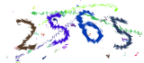

# Captcha

Recognize captcha using deep learning ResNet model and TFLearn

用深度学习残差网络（ResNet）模型实现的验证码自动识别，TFLearn 代码实现




经过学习后自动识别类似上面这样的验证码

> 1000个训练数据，经过短短几分钟的训练，正确率可以达到 99%

详细过程请参考

> 验证码识别-TFLearn 版-单字符-简化-训练.ipynb
>
> 验证码识别-TFLearn 版-单字符-简化-使用.ipynb


# 使用

## 训练

```python
$ python3 train.py -i data -m model
Training Step: 640  | total loss: 0.30894 | time: 8.667s
| Momentum | epoch: 020 | loss: 0.30894 - acc: 0.9710 | val_loss: 0.15319 - val_acc: 0.9613 -- iter: 3196/3196
--
Successfully left training! Final model accuracy: 0.9710448384284973
save trained model to  model/model.tfl
Training Duration 177.041 sec
```

> 第一个参数 -i 指向需要学习的验证码目录
>
> 第二个参数 -m 为学习完成后输出的模型

## 预测

```python
$ python3 test.py -i data -m model
data/0308_1.png 0308
data/1576_1.png 1576
data/8414_1.png 8414
data/0735_1.png 0135
data/9866_1.png 9866
```

## 